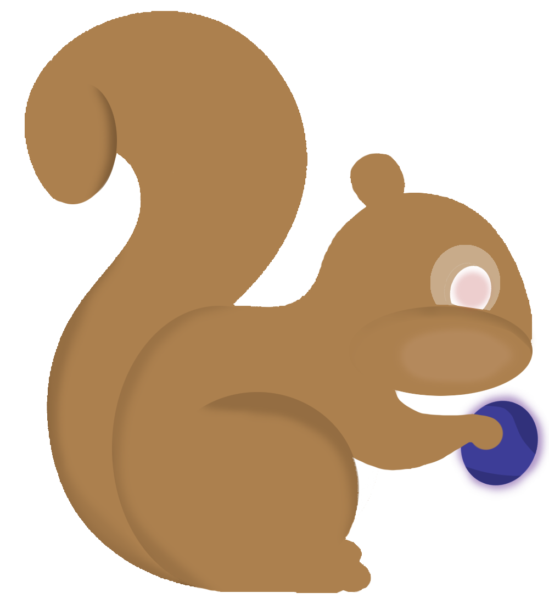

<!--<h1>👋</h1>!-->
<!--

  
  

!-->
<!--<h4>My name is Watcharapol Treesatthayasakul  Study at Computer Science KMUTT</h4>!--><!--

Social
  <li>
    <a href="https://www.facebook.com/watcharapol.treesatthayasakul.96"> Facebook </a>
  </li>
  <li>
    <a href="https://www.instagram.com/o.wt28_/"> Intragram </a>
  </li>

!-->
<!--

Skills
  <li>  C++</li>
  <li>  Python</li>
  <li>  HTML</li>
  <li>  CSS</li>
  <li>  Java</li>
  <li>  JavaScript</li>

xd
!-->
<h3 align="center">Computer science student at KMUTT.</h3>

<h3 align="left">Connect with me:</h3>

<h3 align="left">Languages and Tools:</h3>

                

